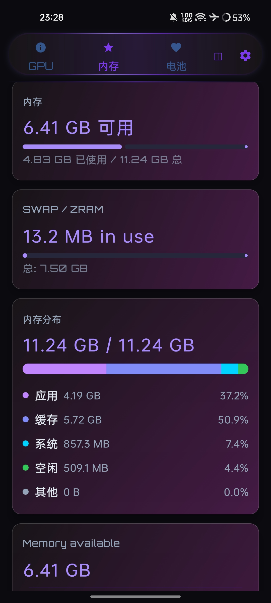
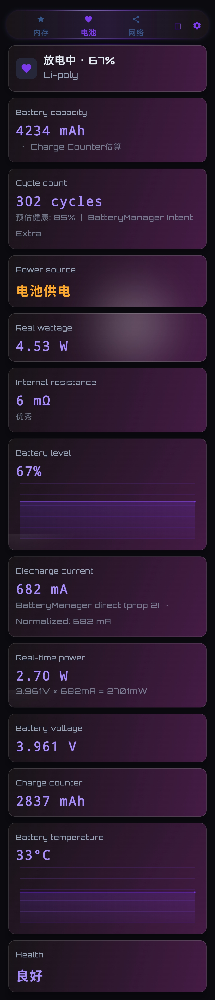
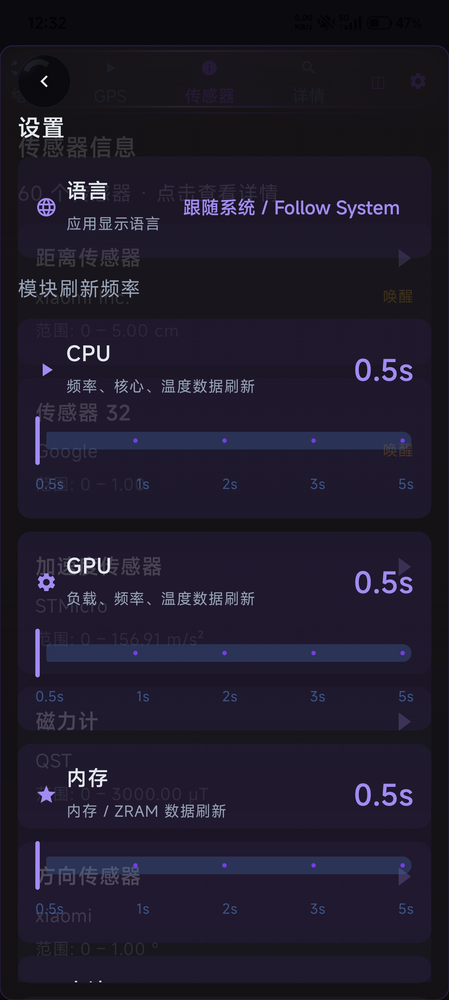
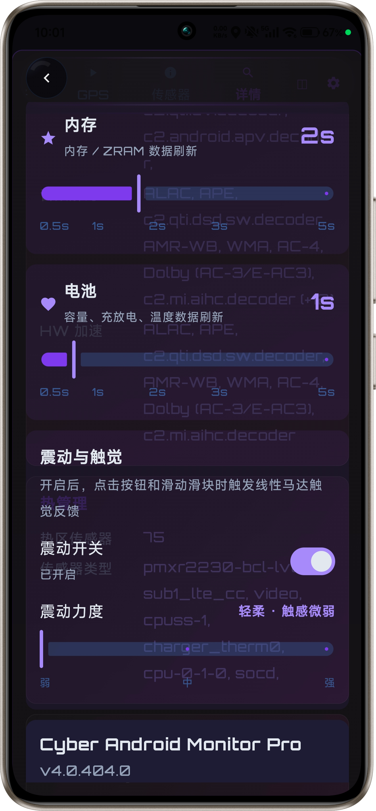
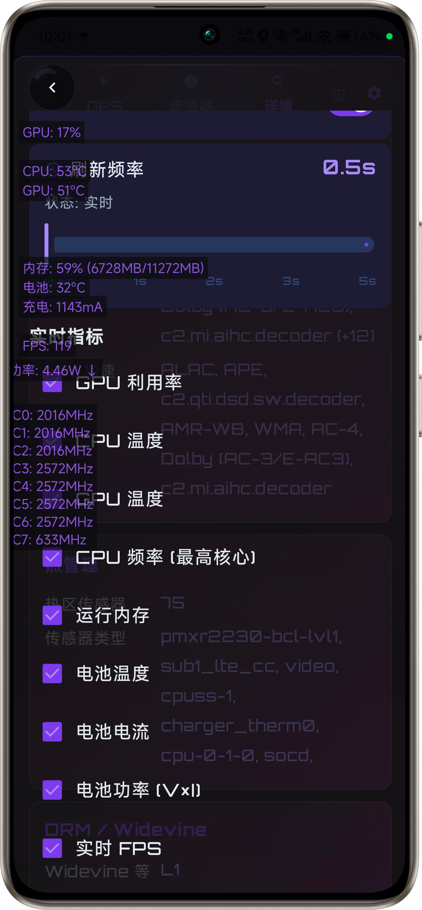

# Cyber-Android-Monitor-Pro 设备性能监控工具 System Monitor(deviceinfoviewer\Device Info Viewer)

现已开放UI体验源码转换的HTML web-simulator Demo 欢迎体验  https://rickeal-boss.github.io/  https://rickeal-boss.github.io/Cyber-Android-Monitor-Pro/


> **⚠️ 重要声明 / License Notice**  
> 本项目采用 [PolyForm Noncommercial License 1.0.0](https://polyformproject.org/licenses/noncommercial/1.0.0/) 许可证。完整法律文本请查阅项目根目录下的 `LICENSE` 文件。  
> **源码公开，仅供个人学习、研究和非商业用途**。  
> 严禁将本软件打包出售，或作为付费服务、SaaS 托管服务的一部分。  
> 严禁在本软件的衍生作品中接入广告以获取直接或间接的商业收益。
> 
> *This project is source-available and free for **personal, educational, and non-commercial use only**. Commercial use is strictly prohibited without a separate license.*

---

## 🏛️ 项目

Cyber-Android-Monitor-Pro
 System Monitor(deviceinfoviewer) 提供实时、精准的硬件状态数据可视化。通过直观的深/浅色界面，帮助开发者、硬件爱好者和普通用户全面掌握设备运行状态。支持Android 5+

## 归 墟 · 无 界
一台把 Android 碎片化翻到底的硬件检测工具。采用流光果冻设计，具有动态光效果。
无 ROOT · **425** 个字段 · **243** 条 sysfs 路径 · **342** 个系统属性
破壁 · 三个"读不到"
| 他们说 | 真相 | 我们 |
|---|---|---|
| "第三方 App 读不到电池循环次数" | 那是 Android 14 官方字段，就在那儿 | 第一条就够，后面 242 条是留给老设备的 |
| "SELinux 把 sysfs 全拦了" | 拦的是通用路径，OEM 私有节点另说 | 读出厂商内核源码，逐条标注单位 |
| "Android 没有 Java 层 Vulkan 绑定" | 确实没有 —— 那就自己写 | `dlopen` 直连原生接口，真实枚举扩展 |

## ⚡ 七大核心能力

### 多级下探 · `ABYSSPROBE`

**243 条 sysfs 路径的 Fallback 链。** 以 CPU 温度为例，共七级：

```
HardwarePropertiesManager → thermal_zone → 骁龙 TSENS
→ HyperOS thermal_message/ → ColorOS → OriginOS
→ hwmon → dumpsys thermalservice
```

一条读不到就换下一条。电池循环次数、电流、容量、GPU 频率同理。

### 来源标注 · `LUMENSIGHT`

**每个字段返回 `(值, 来源)` 双元组。** 界面上能看到这个数是从哪读的。

- 标准 API 直读 —— 直接显示来源
- 满足条件推算 —— 明写「估算」（如 `Charge Counter估算`）
- 确实读不到 —— 显示 `—`，**不用占位数字把界面填好看**

### 路径记忆 · `PIVOTGRID`

**`PathRegistry` 按机型画像 O(1) 分派路径，而不是每次全量试。**

- 成功路径写入缓存，下次直接命中
- 某条路径探测失败 → **永久关闭该链**，不再重复尝试
- 效果：ColorOS 上每 tick 的 `cat` 调用从 ~150 次降到 **0**

### 电流归一 · `UNIFLOW`

**自动判定 mA / µA，逐条标注内核源码出处。**

| 路径特征 | 单位 | 依据 |
|---|---|---|
| `oplus_chg` / `oplus` / `vooc` | mA | OPPO `oplus_chg.c` |
| `battery` / `bms` / `qcom` | µA | AOSP `sysfs-class-power-supply` |

并修掉一个隐蔽陷阱：通用键 `"battery"` 是 `"oplus_chg/battery/..."` 的子串，
顺序排错会让 ColorOS 电流**偏小 1000 倍**。

### 崩溃自愈 · `AEGISCORE`

**连续崩溃时自动关闭实验性功能，并避免误伤。**

```
连续崩溃 ≥ 2 次 或 5 分钟内再次启动
        ↓ 第二道过滤
崩溃栈含 HDR 相关关键字才真正触发
```

多数实现是「崩两次就关功能」，那会把网络、IO 的崩溃也误算进来。

### 芯片规格库 · `CHIPATLAS`

**24 颗 SoC / 63 个簇规格，把营销名反解成芯片 ID。**

| 内容 | 说明 |
|---|---|
| 规格项 | 制程、微架构、L1/L2/L3、GPU ALU 数、FP32 TFLOPS、ISP、NPU、基带型号 |
| lookup | 精确 ID → 营销后缀剥离 → 营销名映射 → codename 别名（四层） |
| 示例 | "骁龙 8 Gen 3" → `sm8650`；`MT6989U` → `MT6989` |

### 卫星天空图 · `URANOMETRIA`

**Canvas 自绘极坐标图，实时显示头顶的卫星。**

支持 7 大星座 PRN 范围推断（GPS / GLONASS / SBAS / QZSS / BeiDou / Galileo / NavIC），
用于 OEM 不返回星座类型时的兜底。

---

## 🕯️ 闭关 97 天

97 天，812 次提交，32,172 行 Kotlin —— **1 个人，n 次 Code Review。**

期间 76 次推倒重来（Java→Kotlin 迁移、全量改包名）。

| | |
|---|---|
| **812** 次提交 | 其中 134 次在修 bug |
| **32,172** 行 Kotlin | 另有 228 行 C++ 原生探针 |
| **425** 个数据字段 | 覆盖 243 条 sysfs 路径、342 个系统属性 |
| **6** 个测试文件 / **138** 条断言 | 专测纯函数与可注入组件 |

---

| 系统要求 | **Android 5.0（API 21）及以上** |
| 支持架构 | 仅 `arm64-v8a`（32 位设备 Vulkan 探针降级，其余不受影响） |

## 🔒 隐私 · 源码里就没有 INTERNET

不是"这个版本干净"，是**任何构建产物都不可能外传数据**。

- 无 `INTERNET` 权限 · 无网络库 · 无 WebView · 无埋点/分析 SDK
- `allowBackup=false`，阻止云端备份
- 18 处 `Runtime.exec` 全部用于本机 `dmesg` / `logcat` / `dumpsys`，结果只在本机显示

| 权限 | 是否必需 | 说明 |
|---|---|---|
| `ACCESS_FINE/COARSE_LOCATION` | 可选 | 仅 GPS 页 |
| `ACTIVITY_RECOGNITION` | 可选 | 步数传感器 |
| `BODY_SENSORS` | 可选 | 心率（仅前台，未声明后台变体） |
| `NEARBY_WIFI_DEVICES` / `BLUETOOTH_CONNECT` | 可选 | WiFi / 蓝牙信息 |
| `SYSTEM_ALERT_WINDOW` | 可选 | 悬浮窗 |
| `POST_NOTIFICATIONS` | 可选 | 前台服务通知 |
| `READ_PHONE_STATE` | 可选 | 网络制式 |
| `READ/WRITE_EXTERNAL_STORAGE` | **可拒绝** | 代码中未实际使用 |

已移除 `ACCESS_BACKGROUND_LOCATION`。

基于 **MVVM + Koin DI** 架构，**Jetpack Compose + Material3** 构建的全功能 Android 设备信息监控应用。
无 ROOT 权限下实现深度硬件检测，适配小米 HyperOS、OPPO ColorOS、vivo OriginOS 等国产 ROM。

---

## 一 · 深度硬件检测（多级 Fallback）

| 功能模块 | 检测深度 | 层级 |
|---|---|---|
| **CPU 温度** | `HardwarePropertiesManager` 反射 → sysfs thermal_zone（含骁龙 TSENS）→ hwmon / 平台专用 → `SensorManager` → 电池温度降级 | **5 级** |
| **GPU 频率 / 负载** | **43+** sysfs 路径 + 动态属性 + 系统属性回退 + 负载估算兜底 | **8 级**（首次后走快速通道） |
| **电池循环次数** | `EXTRA_CYCLE_COUNT` 标准 Intent → Health AIDL HAL → 旧版 IHealth HAL → `BatteryManager` 隐藏 API → IHealth binder → Health Connect → `/proc` shell | **8 级** |
| **电池电流 / 容量** | 厂商专用节点优先（小米 BMS / OPPO `oplus_chg` / 高通 / MTK / 三星）→ 标准节点 → SoC 差分估算 | 多厂商专项 |
| **GPS 卫星** | API 30+ 直接 `GnssStatus.Callback` → API 24-29 反射 → OEM ROM 静默失效兜底 | 三策略 |

### CPU 温度的 5 级链

```
Level 1   反射 HardwarePropertiesManager（需系统权限）
Level 2   sysfs thermal_zone 扫描 — 骁龙 TSENS 集群聚合
  ├─ 2b   骁龙 TSENS 回退（不限 CPU cluster）
  ├─ 2c   Xiaomi HyperOS thermal_message/ 目录
  ├─ 2d   OPPO ColorOS 专用 thermal zone
  └─ 2e   vivo OriginOS 专用 thermal zone
Level 3   sysfs hwmon / 平台专用路径（高通 / MTK / 三星 / 华为 / OPPO）
Level 4   dumpsys thermalservice
Level 5   电池温度降级（BatteryManager EXTRA_TEMPERATURE）
```

**骁龙专项**：TSENS `cpu-*-*-usr` 传感器集群聚合（prime / performance / efficiency）、`cpuss-*-usr` CPU 子系统温度。

**HyperOS / Android 14+ SELinux 收紧**： `/sys/class/thermal/` 可能被 SELinux 完全限制，
此时 Level 1 与 Level 4 成为主路径，Level 5 兜底。

### 两条配套的性能设计

**① 失败路径永久关闭** —— `SysFsCapabilityProbe` 首次探测某路径不可读后，此后该链**永久关闭**。
ColorOS 上每 tick 的 `cat` 调用从 **~150 次降到 0**。

**② 成功路径快速通道** —— `GpuDataSource` 缓存上次成功的解析路径，后续 tick 直接命中，
**跳过 8 级 fallback 全扫描**。

---

## 二 · 电流单位归一化（电流读数的核心）

**这是"国产 ROM 适配"最关键的一处。** 无 ROOT 读电流最大的坑不是路径被拦，而是**单位不一致**。

| 路径特征 | 单位 | 内核源码出处 |
|---|---|---|
| `oplus_chg` / `oplus` / `vooc` | **mA** | OPPO `oplus_chg.c` |
| `battery` / `bms` / `qcom` | **µA** | AOSP `sysfs-class-power-supply`、CodeLinaro `qpnp-vm-bms.c` |
| 三星 `sec_battery` | 按节点 | OSRC `sec_battery.c` |
| MTK `mtk_battery` | 按节点 | `drivers/power/supply/mtk_battery.c` |

**一个隐蔽陷阱（子串遮蔽）**：

通用键 `"battery"` 是 `"oplus_chg/battery/..."` 的**子串**。
若通用键排在前面，`firstOrNull { path.contains(key) }` 会先命中 `battery` → 判成 µA →
**ColorOS 电流偏小 1000 倍**。

解法是**专用键排前、通用键排后**。

---

## 三 · 赛博朋克主题

> 设计灵感来自 Batman 的冷峻科技感。

| 元素 | 实现 |
|---|---|
| 配色 | 纯紫霓虹 `NeonPurple` / `Bright` / `Pale` / `Deep` |
| 字体 | 矩阵数字字体 + **Orbitron**（Bold 标题 / Medium 正文，经 `MaterialTheme.typography` 全局注入） |
| 特效 | 扫描线动画、全面屏 Edge-to-Edge |
| 全局光照 | `GlobalLightState`：Canvas 径向渐变 + **AGSL RuntimeShader（API 33+）**，Spring 动画跟随手指（设置页可整体关闭） |
| 亚克力 | Acrylic 噪点覆盖层（Win10 Fluent 风格） |
| 图标 | **全部自绘**（`CyberIcons`），排除 `material-icons-extended` → release APK **−2~4 MB**，dex 少 **2000+ 类** |

## 镜瓷白·天青主题

> 设计灵感来自 潮汕“嵌瓷” 的多彩质感

### AGSL 的两处硬坑（源码注释有完整记录）

**① `RuntimeShader` 的 `NoClassDefFoundError`**

即便外面裹了 `if (SDK_INT >= TIRAMISU)`，Kotlin 仍会在守卫**之外**生成 `CHECKCAST`
来强转 `remember` 返回值。ART 执行该指令前必须先解析该类 —— API 26 上类不存在 → 直接崩溃。

**R8 的 API modeling 会把它抽成 `$$ExternalSyntheticApiModelOutline0.m()`，调用点仍无条件执行，守卫形同虚设。**
表现为 **debug 不重现、仅 release 崩**。

解法：把高版本类型隔离到**独立文件**，调用方只用 `Any` 传句柄，让 ART 永远不加载这个类。

**② EGL 常量写错导致 HDR 静默失效**

```
EGL_GL_COLORSPACE_BT2020_PQ_EXT 必须是 0x3340
（旧值 0x3531 是错的 —— EGL 会静默忽略，
  surface 实际从未标 PQ，永远停留在 8-bit SDR）
```

**③ HDR 二阶段探测**

`predictedCapable`（事前预测，会误判）+ `isHdrLayerObserved`（运行时权威，`getHdrSdrRatio() > 1.01`）。
注释明确：**仅"调用成功"不算**。

**④ 省电 / 发热抑制** —— 省电模式开启、或 thermal status ≥ `MODERATE` 时自动抑制局部 HDR，
避免增亮**加剧整机发热与耗电**。

---

## 四 · 国际化（i18n）

| 项 | 实现 |
|---|---|
| 语言 | **3 种**：简体中文 `zh-CN`（默认）/ 英文 `en` / 繁体中文 `zh-TW` |
| API 33+ | `AppCompatDelegate.setApplicationLocales` 实时切换 |
| API <33 | `attachBaseContext` wrapContext + 手动 `recreate` |
| 繁体转换 | **OpenCC s2twp**（词组级，非单字映射） |
| 系统级支持 | `res/xml/locales_config.xml` 声明 `locale-config`，接入 Android 13+ per-app language |
| RTL | `supportsRtl="true"`，已为阿拉伯语等预留 |

> 语言切换需要重启生效。

---

## 五 · 悬浮窗系统

### 9 项指标（ `metricToggles` ）

```
gpu_usage      GPU 使用率
cpu_temp       CPU 温度
gpu_temp       GPU 温度
cpu_freq       CPU 频率
ram            内存占用
battery_temp   电池温度
battery_cur    电池电流
battery_pow    电池功率
fps            实时帧率
```

每项可独立开关。

### 刷新间隔

**全局单一值**（`FloatingWindowConfig.refreshIntervalFlow` 只有一个 `StateFlow`），
非"每指标独立"。

档位：`refreshStepOptions = { 500, 1000, 2000, 3000, 5000 }`（单位 ms）。
默认值 `DEFAULT_REFRESH_MS = 500L`。

### 采集架构

| 设计 | 作用 |
|---|---|
| 订阅 `DeviceRepository` SharedFlow | 消除重复采集 |
| `postDelayed` 移入采集回调内 | 串行化，杜绝任务堆积 |
| `tickInFlight` 防重叠标志 | sysfs 慢时不叠加下一轮 |
| SharedPreferences 持久化 | 含**位置记忆** |
| 前台服务保活 | `foregroundServiceType = "specialUse"` |
| 实时 FPS | `Choreographer` 独立驱动，`onDestroy` 前正确释放 |

### 采集真值表

| 悬浮窗 | App 状态 | 是否继续采集 |
|---|---|---|
| 关 | 退后台 | ❌ 停 |
| 开 | 退后台 | ✅ 继续 |
| 开 | Activity 销毁 | ✅ 继续 |

> **用 `ON_STOP` 而非 `ON_PAUSE`**：通知栏下拉 / 权限对话框只触发 `ON_PAUSE`，
> 用它会**误杀前台采集**。

### 快捷设置磁贴

`FloatWindowTileService`（API 24+，`BIND_QUICK_SETTINGS_TILE` 仅系统可绑定）。
**启动失败时回滚开关状态**，避免"开关显示已开但窗口没出现"的假状态。

> API 21-23 上系统忽略该声明，**类永不加载，无副作用**。

---

## 六 · 9 大 Tab

| Tab | 功能 |
|---|---|
| **概览** | 核心指标一屏总览，卡片可拖拽排序（`reorderable` 3.1.0） |
| **CPU** | 每核实时频率 / 温度 / 使用率曲线，核心簇分组，governor |
| **GPU** | 频率 / 负载 / 温度，43+ 路径多层级 Fallback |
| **内存** | RAM 使用率 + 运行内存各维度占用分布 + **ZRAM 压缩比** |
| **电池** | 温度 / 电流 / 电压 / 设计容量 / 实际满充容量 / SoH / 循环次数 / 充电协议 / 省电模式 |
| **网络** | WiFi / 移动数据速度 + 信号强度 + 附近 AP + **34 个 5G NR 频段**（ARFCN 反推带宽） |
| **GPS** | 卫星天空图（Canvas 自绘极坐标）+ 搜星状态 + 速度 + 海拔 |
| **传感器** | **34 种**类型元数据 + 实时波形（80 采样点，贝塞尔平滑），支持 XYZ 三轴与单线 |
| **详情** | 屏幕 / 存储 / 相机 / OEM ROM 深度信息 |

**次级页 5 个**：设置、悬浮窗配置、传感器详情、HDR 实验室、首次启动权限引导。

---

## 七 · 智能刷新策略（RefreshPolicy）

| 档位 | 间隔 | 用途 |
|---|---|---|
| `HIGH` | 500 ms | 悬浮窗实时、传感器高速采样 |
| `NORMAL` | 2 000 ms | 主监控默认 |
| `ECONOMY` | 5 000 ms | 后台全局降级 |
| `SLOW` | 10 000 ms | GPS 状态巡检 |
| `IDLE` | 30 000 ms | 开机时长等极低频项 |

**省电模式强制封顶 5 s**（`PowerManager.isPowerSaveMode`），无论前后台。

### 前后台

后台**保持数据全速采集**，仅暂停动效渲染（全局光照 Spring 动画 + 指针事件）。

### 分模块配置

CPU / GPU / 电池 / 内存各自独立间隔，在设置页逐模块调节。

### 轮询调度（`PollingFlow`）

```kotlin
val elapsed = System.currentTimeMillis() - start
val remaining = (delayMs - elapsed).coerceAtLeast(0L)
if (remaining > 0) delay(remaining)   // 周期补偿，否则间隔持续漂移

catch (e: CancellationException) { throw e }  // 官方铁律：必须重抛
catch (_: Throwable) { /* 业务异常吞掉，不影响下一轮 */ }
```

---

## 八 · 设置页

| 项 | 值 |
|---|---|
| 刷新频率 | **5 档**：`0.5s / 1s / 2s / 3s / 5s` |
| 分模块 | CPU / GPU / 电池 / 内存各自独立间隔 |
| 覆盖层动画 | 进入 / 退出 |
| 语言 | 简中 / English / 繁中 |
| 主题 | 全局光照总开关 |

---

### 预测性返回（Android 15+）

`PredictiveBackHandler` —— **国产 ROM 不支持时自动降级为传统返回**：
flow 为空时立即完成，等价普通 `BackHandler`，覆盖层仍能正常关闭（仅无动画）。

---

### 滑块非均匀档位修复

> 非均匀离散档位 `{500,1000,2000,3000,5000}` 在 `500..5000` 范围上的实际位置占比为
> **0% / 11.1% / 33.3% / 55.6% / 100%**，导致标签与滑条实际档位位置完全不匹配
> （如 5s 标签紧贴 3s）。修复：用 weight 比例分布。

---

### SP 与 StateFlow 一致性修复

> 原 setter 只对 StateFlow 做 `coerceIn`，SP 却写原始值 →
> **进程重启后读回未约束的非法值**。

---

## 九 · 隐私安全（完全本地运行）

| 安全项 | 状态 |
|---|---|
| `INTERNET` 权限 | ❌ **无**（源码层面不存在，非"某版本干净"） |
| 网络通信 | ❌ 零 HTTP 调用 / 零 WebView / 零遥测 |
| 埋点 / 分析 SDK | ❌ 零 |
| 数据导出 | ✅ 仅通过系统 ShareSheet（用户控制） |
| `allowBackup` | ❌ `false`（阻止云端备份） |
| 所有数据 | ✅ 完全本地化 |

18 处 `Runtime.exec` 全部用于本机 `dmesg` / `logcat` / `dumpsys`，结果只在本机显示。

---

## 分层总览

```
┌──────────────────────────────────────────────────────────┐
│  UI Layer · Jetpack Compose (70 文件)                    │
│  ├─ Screen × 14                                          │
│  │   主 Tab × 9 + 次级页 × 5                             │
│  ├─ Components × 9                                       │
│  ├─ Effects × 15                                         │
│  └─ Theme + i18n (简中 / 繁中 / English)                 │
└────────────────────┬─────────────────────────────────────┘
                     │ observe
┌────────────────────▼─────────────────────────────────────┐
│  ViewModel Layer · 13 个 (Koin DI)                       │
│  AppVM · DashboardVM · CpuVM · GpuVM · MemoryVM          │
│  BatteryVM · NetworkVM · GpsVM · SensorsVM               │
│  SensorDetailVM · DeviceVM · OemVM · SettingsVM          │
└────────────────────┬─────────────────────────────────────┘
                     │ collect
┌────────────────────▼─────────────────────────────────────┐
│  Repository Layer · 5 组件                               │
│  ├─ DeviceRepository  全局单例，双管道输出                 │
│  ├─ PollingFlow       轮询调度（周期补偿 + 取消传播）      │
│  ├─ HistoryCache      300 点/系列 × 15 系列 ≈ 180 KB      │
│  ├─ AuxiliaryCollector  WiFi/移动网络/存储/网口/GPS 并行   │
│  └─ HealthTracker     13 个数据源健康度 OK/WARN/ERROR     │
└────────────────────┬─────────────────────────────────────┘
                     │ read
┌────────────────────▼─────────────────────────────────────┐
│  DataSource Layer · 26 个 (11,770 行)                    │
│  ├─ 采集类  CpuDS · GpuDS · BatteryDS · MemoryDS          │
│  │          StorageDS · WifiDS · MobileNetworkDS          │
│  │          NetworkInterfaceDS · GpsDS · SensorDS          │
│  │          SystemDS · DeviceDetailDS · OemDS              │
│  ├─ 基础设施 SysFsReader · ShellCommandDS · PathRegistry   │
│  │          SysFsCapabilityProbe · BaseSysFsDataSource     │
│  ├─ 知识库  CpuCache (24 SoC / 63 簇)                      │
│  ├─ 算法    AltitudeComputer · DumpsysMeminfoParser        │
│  │          StepCounterStore · HardwareDiagnoser           │
│  ├─ 持久化  BatteryDataStore                               │
│  ├─ 原生    VulkanProbe (JNI)                              │
│  └─ 预留    RootGate（当前无调用点）                        │
└────────────────────┬─────────────────────────────────────┘
                     │
┌────────────────────▼─────────────────────────────────────┐
│  System Layer                                            │
│  ├─ /sys  /proc  （直接 Java IO，失败退 exec cat）         │
│  ├─ dumpsys · logcat · dmesg （18 处，全部带超时）          │
│  ├─ Android 标准 API（BatteryManager / SensorManager …）    │
│  └─ Native: libcybervulkan.so（dlopen，不链接）            │
└──────────────────────────────────────────────────────────┘
```
---

## 技术栈

compileSdk  = 36  (锁定，Material Design 3兼容性约束)
targetSdk   = 36
minSdk     = 21
Kotlin     = 2.2.10
Compose    = 2025.06.00
Java       = 17
AGP​        = 9.0.1
Gradle​     = 9.1.0
NDK​        = r29 (29.0.14206865)
CMake​      = 3.22.1+
ABI​        = arm64-v8a

---

### 🔧 构建优化

- R8 混淆规则清理：proguard-rules.pro 极致精简
- 收紧 kotlin 保留范围
- 删除废弃的 `android.experimental.r8.dex-startup-optimization`（AGP 8.x 已废弃）
- 仅 arm64-v8a 其它 ABI 上 UnsatisfiedLinkError 被捕获后静默降级，功能不缺失​
- 剔除 material-icons-extended APK −2~4MB，dex 少 2000+ 类

---

### 数据源健康监控

•SourceHealth 数据类跟踪 13 个数据源状态
•DataSourceHealthBar 组件实时展示错误数量
•多级 fallback 链的 catch 保持静默（预期失败路径）
•仅 Repository 级别记录异常

---

### 📈 `LineChart` 绘制管线

① 入场动画   Animatable(0f) → animateTo(1f, tween(400))
              ↓ revealProgress 驱动 visibleCount 从 2 增长到 data.size
② 坐标计算   FloatArray 预分配 xs[] / ys[]，Canvas 内直接填充（零对象分配）
③ 面积填充   areaPath.reset() → moveTo 底部 → cubicTo 逐段 → close() → drawPath(areaBrush)
④ 折线       linePath.reset() → moveTo 首点 → cubicTo 逐段 → drawPath(gradientBrush, Stroke)
⑤ 网格       可选，gridLines+1 条横线
⑥ 尾点       drawCircle 高亮最新数据点

---

**贝塞尔平滑**：相邻两点间用 `cubicTo`，控制点取 x 方向中点：

```kotlin
val cx = xs[i - 1] + (xs[i] - xs[i - 1]) * 0.5f
path.cubicTo(cx, ys[i - 1], cx, ys[i], xs[i], ys[i])
```

**单点兜底**：`data.size == 1` 时直接画圆点，避免 `(n-1)` 除零。

---

## 零分配绘制（6 项优化）

| # | 优化 | 做法 |
|---|---|---|
| 1 | **移除无效 `derivedStateOf`** | `remember(data)` 已按引用缓存，对 `List<Float>` 再包一层是纯开销 |
| 2 | **移除 `Offset` 中间对象** | 改用 `FloatArray` 预分配，Canvas 内直接填值 |
| 3 | **`Path` 对象复用** | `remember { Path() }` + 每帧 `reset()`，动画期间零 GC |
| 4 | **`areaBrush` 提到 Composition 层** | `remember(areaColor)`，不再每帧新建 `Brush` |
| 5 | **`safeCoerceIn` inline** | 消除热路径函数调用开销，且自动交换 min/max 防止 `IllegalArgumentException` |
| 6 | **网格缓存** | `remember(showGrid, gridLines)` 缓存 `Pair<Int, Color>` |

**数值安全**：`sanitize(v)` 把 `NaN` / `Infinity` 统一转 `0f`——高频采样中传感器偶尔返回非法值，不处理会让整条 Path 绘制失败。

---

## HDR 图表贴片

`LineChart` / `DualLineChart` 都有 `hdrKey` 参数。非空时，把**折线本体 + 网格线**画进 PQ surface。

### 难点

折线坐标**只能在布局后**才知道（依赖 `size` 与窗口偏移），而 HDR 贴片需要**窗口坐标系**的点序列。

### 解法

在 `onGloballyPositioned` 内，用**与 `LineChart.kt` 内部绘制完全一致的公式**重算一遍并上报：

```kotlin
// 与绘制公式严格一致，保证像素级对齐：
//   pad = 8.dp    v ∈ [0,1]    xStep = cw / (n - 1)
Modifier.onGloballyPositioned { coords ->
    holder.winX = coords.localToRoot(Offset.Zero).x
    holder.winY = coords.localToRoot(Offset.Zero).y
    holder.w = coords.size.width.toFloat()
    holder.h = coords.size.height.toFloat()
    report()
}
```

上报两类贴片：

| 类型 | 内容 | 亮度 |
|---|---|---|
| `CHART_LINE` | 整条折线点序列 + 尾点 | `HDR_LINE_MULT` |
| `CHART_GRID` | `gridLines + 1` 条横线端点（GL_LINES 成对） | `HDR_GRID_MULT` |

### 三个细节

**① 实时刷新** —— `LaunchedEffect(data, enabled)`，数据变化时重新上报。

**② 卸载清理** —— `DisposableEffect` 的 `onDispose` 里移除贴片，**避免切页后残留"幽灵折线"**。

**③ 关开关也移除** —— `report()` 里先判断 `enabled`，为 false 时主动 remove，否则关闭开关后贴片会留在屏幕上。

---

## `DualLineChart` 的 x 坐标对齐

`NetworkScreen` 用它对比 Wi-Fi 速率与信号强度——**两条线数据量不同**（一个可能 300 点，一个 80 点）。

**HDR 上报**：双线各自上报（`hdrKey` 与 `hdrKey + ".b"`），第二条不上报网格，避免重复。

---

## 传感器波形

### `SensorLineChart`（单轴）

```
maxChartPoints = 80          ← 环形裁剪，超出移除最旧
derivedStateOf × 5 层：
  recent  = data.takeLast(80)
  values  = recent.map { it.value }
  minVal  = values.minOrNull()
  maxVal  = values.maxOrNull()
  range   = (maxVal - minVal).coerceAtLeast(0.001f)   ← 防除零
```

带 Y 轴刻度（`leftPad = 36.dp`）、轴色 `NeonPurple.copy(0.45f)`、标签色 `NeonPurpleBright.copy(0.55f)`、网格 `NeonCyan.copy(0.12f)`。

### `MultiAxisChart`（多轴）

多序列共用**全局 min/max**（`flatMap` 后取极值），保证各轴比例一致、可横向比较。


**同一个优化，一处删、一处留** —— 因为数据类型不同：

| 数据源 | 类型 | 决策 |
|---|---|---|
| `LineChart` | `List<Float>`（每次归一化都产生新对象） | **删除**，`remember(data)` 够用 |
| 传感器 | `SnapshotStateList`（引用不变、内容变） | **保留**，否则永远不重组 |

---

## `ChartUtils`

### `normalizeChartData()`

把历史点归一化为 `[0..1]` 的 `List<Float>`，**去重了 6 份重复定义**。

原分布：
`BatteryScreen` / `CpuScreen` / `DashboardScreen` / `GpuScreen` / `MemoryScreen` / `NetworkScreen`

```kotlin
fun normalizeChartData(
    points: List<HistoryDataPoint>?,
    maxValue: Float,
    takeCount: Int = 80,
    emptyFill: Float = 0f
): List<Float>
```

| 处理 | 说明 |
|---|---|
| **单次遍历** | 替代 `takeLast + map` 两次列表分配（★ 性能优化 2026-06-21） |
| **空值兜底** | 数据为空时返回 `List(15) { emptyFill }`，而不是空列表——避免图表塌缩 |
| **上限保护** | `maxValue <= 0` 或 `NaN/Inf` 时降级为 `1f` |
| **值清洗** | 逐点 `NaN`/`Infinity` → `0f` |
| **区间约束** | `coerceIn(0f, 1f)` |

各屏调用时的第二参数是量程，例如：

```
cpu_temp → 100f     battery_temp → 60f     battery_level → 100f
battery_power → 30000f    wifi_speed → 1000f    cpu_freq → clusterMaxFreq/1000f
ram_usage → 100f, emptyFill = 0.5f   ← 内存页用中线填充，视觉更合理
```

### `normalizeSignalStrength()`

dBm 专用映射：`(dBm + 130) / 100`，把 **[-130, -30] dBm → [0, 1]**。

### `formatIntervalMs()`

毫秒转人类可读（`200 → "200ms"`、`2000 → "2s"`、`30000 → "30s"`）。

---

## 数据流全景

```
DataSource 采集
    ↓
HistoryCache（300 点/系列 × 15 系列 ≈ 180 KB）
    ↓
各 Screen: remember(histData) { derivedStateOf { ChartUtils.normalizeChartData(...) } }
    ↓  归一化到 [0..1]，取最近 80 点
LineChart / DualLineChart / SensorLineChart / MultiAxisChart
    ↓  FloatArray 零分配绘制
Canvas
    ↓  hdrKey 非空
HdrPatchRegistry → PQ surface（局部 HDR）
```

**每轮绘制的数据量**：

| 阶段 | 点数 |
|---|---|
| `HistoryCache` 缓冲 | 300 / 系列 |
| `normalizeChartData(takeCount = 80)` | **80** |
| 图表实际绘制 | 80（入场动画期间从 2 递增） |

---

## 本项目的技术债集中在**状态容器选型**（LiveData vs StateFlow）
但复杂度根本不在架构层——而在 DataSource 那 26 个文件、11,770 行里：

- 243 条 sysfs 路径的 Fallback 链
- 电流单位归一化（mA / µA，逐条标注内核源码出处）
- OEM ROM 私有路径与属性适配
- 传感器派生算法、步数账本、气压海拔反演
- 芯片规格知识库与营销名反解

**把 LiveData 换成 StateFlow，一个数据都不会变得更准。**

P2#8 已写进代码注释，评估了成本、且判断当前不值得动——
这在工程上是成熟决策，而非疏忽。

---

### 🥇🥈🥉🀄 OEM ROM 深度识别
|OEM	|系统	|专属属性（15+）|
|-------|-------|--------------|
|小米	|HyperOS/MIUI	|miui.ui.version / miui.region / has_real_blur|
|OPPO	|ColorOS	|version.opporom / oplus.display / oplus_chg battery|
|Vivo	|OriginOS	|vivo.os.version / product.solution / hardware.version|
|SoC 制造商 + 型号识别|
|游戏模式 / 高性能模式检测|
|30+ 条厂商原始属性检测|

---

### 🔌 充电协议自动识别

•PD (Power Delivery)
•QC 3.0 (Quick Charge)
•SuperVOOC (OPPO)
•VOOC (OPPO)
•Mi Turbo Charge (小米)

---

### 📄 权限说明

|权限	|用途	| 需 |
|-------|-------|----|
|组	| 权限 |
|网络 |	ACCESS_WIFI_STATE CHANGE_WIFI_STATE ACCESS_NETWORK_STATE NEARBY_WIFI_DEVICES|
|位置	|ACCESS_FINE_LOCATION ACCESS_COARSE_LOCATION|
|传感器	|ACTIVITY_RECOGNITION BODY_SENSORS|
|设备	|READ_PHONE_STATE BLUETOOTH(≤30) BLUETOOTH_CONNECT|
|界面	|SYSTEM_ALERT_WINDOW POST_NOTIFICATIONS VIBRATE|
|服务	|FOREGROUND_SERVICE FOREGROUND_SERVICE_SPECIAL_USE|
|存储	|READ_EXTERNAL_STORAGE(≤32) WRITE_EXTERNAL_STORAGE(≤28)|

---

### 📚🤯 学术验证

通过 Sciverse 学术论文检索 验证架构设计：理论上学术论文不会骗人吧？

---
---

###  最后：
闭关 + 谦虚低调听劝 + 重构 + 架构重组 + 审美引用 + 引经据典 + 内卷 + 连夜赶工 + 取长补短（借鉴不抄并超越） + 功能体验吊打** + 首创（绝无仅有） + 首发 + 极致提升 + 移除冗余 + 超高效率 + 修bug + 极致瘦身剔除 + …… =  行业State of the art

---
---

### 旧版本AI评测：GLM5.1自动化解析审查代码测试报告
详情见(device-info-viewer-review.html)

---

### APP图示












---

### 参与审查的模型：GLM-5.3 GLM-5.3-flash  GLM-5.2 为架构审查模型以及 DeepSeek V4 Pro DeepSeek V4 Pro-0813为主力评审模型，DeepSeek V4 Flash、GLM-5.1、GLM-5.0 Turbo 为辅助模型,小部分代码为 Hy3 改写（依旧免费···）
