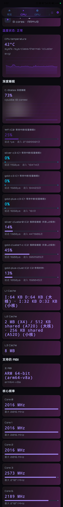
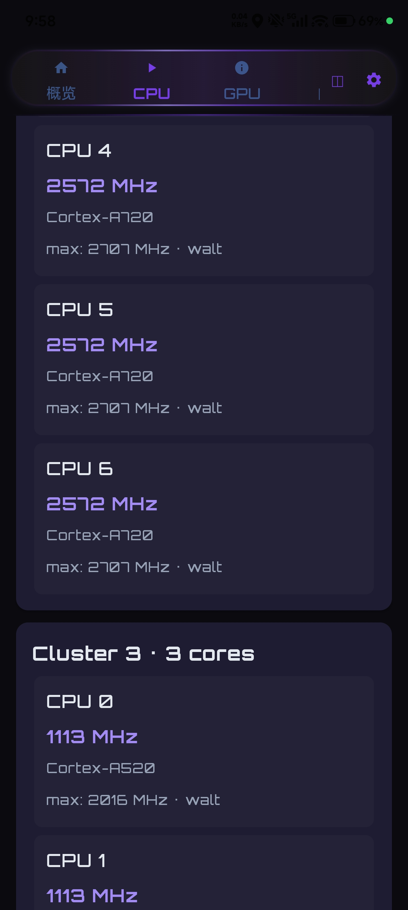
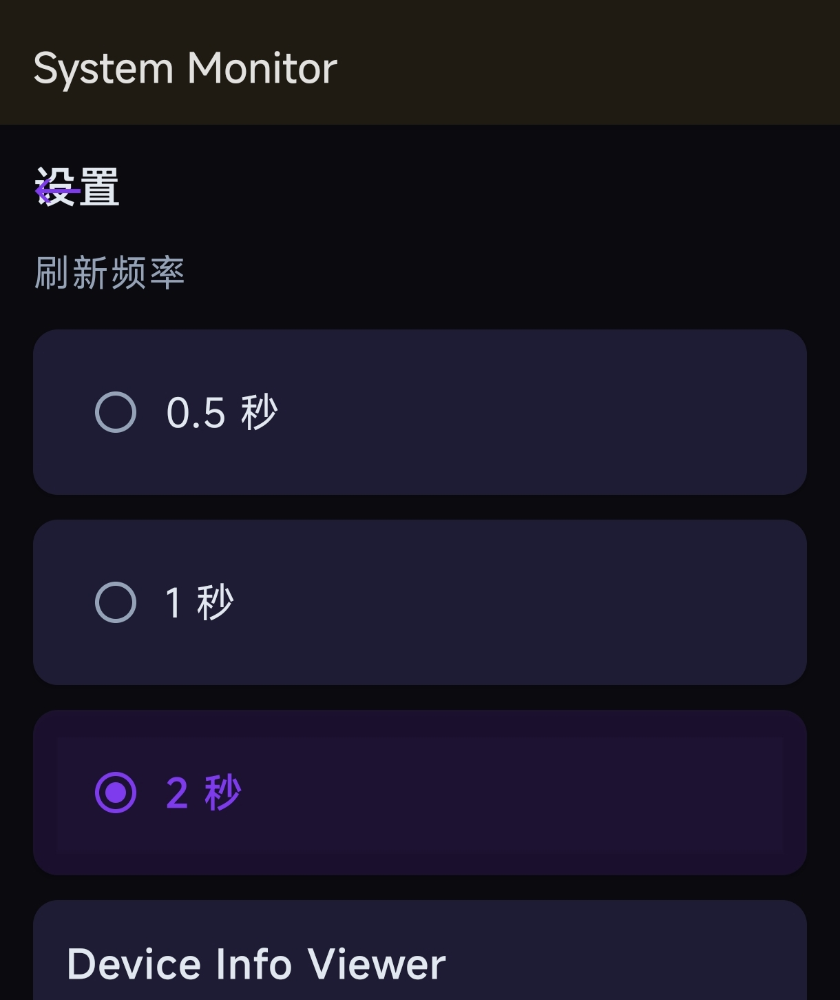
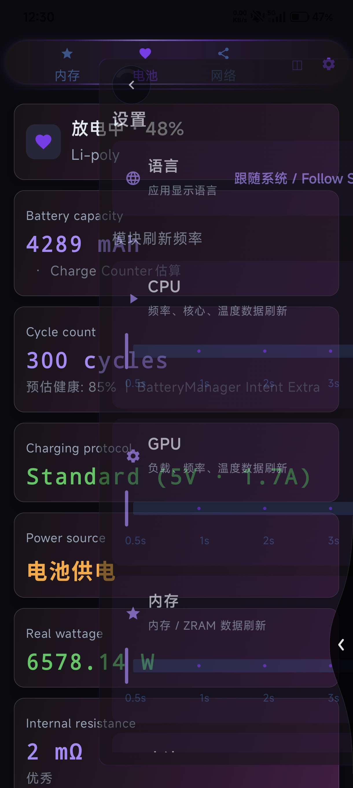

# Cyber-Android-Monitor-Pro-By-RB 设备性能监控工具 System Monitor(deviceinfoviewer\Device Info Viewer)


> **⚠️ 重要声明 / License Notice**  
> 本项目采用 [PolyForm Noncommercial License 1.0.0](https://polyformproject.org/licenses/noncommercial/1.0.0/) 许可证。完整法律文本请查阅项目根目录下的 `LICENSE` 文件。  
> **源码公开，仅供个人学习、研究和非商业用途**。  
> 严禁将本软件打包出售，或作为付费服务、SaaS 托管服务的一部分。  
> 严禁在本软件的衍生作品中接入广告以获取直接或间接的商业收益。
> 
> *This project is source-available and free for **personal, educational, and non-commercial use only**. Commercial use is strictly prohibited without a separate license.*

---

## 🏛️ 项目

Cyber-Android-Monitor-Pro-By-RB
 System Monitor(deviceinfoviewer) 提供实时、精准的硬件状态数据可视化。通过直观的深色界面，帮助开发者、硬件爱好者和普通用户全面掌握设备运行状态。支持Android 5+

## 🗼 核心功能
> 基于 **MVVM + Koin DI** 架构，**Jetpack Compose + Material3** 构建的全功能 Android 设备信息监控应用。
> 无 ROOT 权限下实现深度硬件检测，适配小米 HyperOS、OPPO ColorOS、Vivo OriginOS 等国产 ROM。

---

## 🛞 核心亮点

### 🔬 深度硬件检测（多级 Fallback 策略）

| 功能模块 | 检测深度 | Fallback 层级 |
|---------|---------|--------------|
| **CPU 温度** | HardwarePropertiesManager → sysfs thermal_zone → hwmon/平台专用 → SensorManager → 电池温度 | 5 级 |
| **GPU 频率/负载** | 50+ sysfs 路径 + 动态属性 + 负载估算 | 5 层 |
| **电池循环次数** | BatteryManager 隐藏 API → 50+ sysfs 路径 → dumpsys | 8 级 |
| **电池电流/容量** | 小米 BMS → OPPO oplus_chg → 15+ 路径 | 多厂商专项 |
| **GPS 卫星** | GNSS Status Callback (API 30+) + 反射兼容 (API 21-23) | 双 API |

### 🚀🏺 骁龙平台专项优化
- 扫描 `thermal_message/` 直接温度文件（HyperOS 专用）
- 高通 `qcom-battery/` 电池循环计数路径
- CpuCache.lookup() 4 策略匹配（直接匹配 → 规范化去前缀 → MTK 数值段 → codenameAliases）

### 🎨 Bat 灵感的未来科技赛博朋克主题
- 纯紫霓虹配色（NeonPurple/Bright/Pale/Deep）
- 脉冲指示器（PulseDot）实时监测标志
- 矩阵数字字体 + 扫描线动画
- 全面屏 Edge-to-Edge 设计
- 全局光照效果（GlobalLightState）：Canvas 径向渐变 + AGSL RuntimeShader（API 33+），Spring 动画跟随手指
- Acrylic 亚克力噪点覆盖层（Win10 Fluent 风格）
- 脉冲指示器（PulseDot）实时监测标志
- Orbitron 字体（Bold 标题 / Medium 正文，通过 MaterialTheme.typography 全局注入）
---

### 🌐 国际化（i18n）
- 支持 3 语言：简体中文（默认）/ 英文 / 繁体中文
- API 33+：`AppCompatDelegate.setApplicationLocales` 实时切换
- API <33：`attachBaseContext` wrapContext + 手动 recreate
- 繁体中文通过 OpenCC s2twp 自动转换
- 语言切换需要重启

### 🖥️ 悬浮窗系统 6th generation
- 9 项指标独立开关：CPU / GPU / 电池 / 内存 / 温度 / 网络 / GPS / Hz / FPS
- 每指标可配置刷新间隔：9 个指标各自独立，步进 0.2s / 0.5s / 1s / 2s / 5s / 10s / 30s
- 间隔变更即时生效，无需重启悬浮窗
- 串行采集架构：postDelayed 移入采集回调内，杜绝任务堆积；tickInFlight 防重叠
- 订阅 DeviceRepository SharedFlow，消除重复采集
- 实时 FPS 监控（Choreographer 独立驱动，正确释放）

## 📱 功能模块（9 大 Tab）
| Tab | 功能 |
|-----|------|
| **概览** | 设备核心信息一览，全局光照效果 |
| **CPU** | 频率/温度/使用率实时曲线，核心簇分组 |
| **GPU** | 频率/负载/温度，多路径 Fallback 检测 |
| **内存** | RAM 使用率 + 运行内存各维度占用分布 |
| **电池** | 温度/电流/电压/容量/SoH/循环次数/充电协议识别/省电模式检测 |
| **网络** | WiFi/移动数据速度 + 信号强度 + 附近 AP 信号 |
| **GPS** | 卫星天空视图（SatelliteSkyView）+ 搜星状态 + 速度 |
| **传感器** | 10 种传感器实时波形（Canvas 自绘，80 采样点贝塞尔平滑），包括XYZ及单线 |
| **详情** | 设备硬件信息全览（OEM ROM 深度识别） |

### 🔋 智能刷新策略（RefreshPolicy）
- 前台/后台双模式：后台保持数据全速采集，仅暂停动效渲染（全局光照 Spring 动画 + 指针事件）
- 省电模式检测：系统级 `PowerManager.isPowerSaveMode`，开启时自动封顶 5s
- 省电模式开启时，电池页显示橙色警示卡片提醒用户
- 分模块配置：CPU / GPU / 电池 / 内存各自独立刷新间隔，在设置页逐模块调节

### ⚙️ 设置页（Android 15 预测性返回）
- 刷新频率 5 档可选：0.5s / 1s / 2s / 3s / 5s
- 分模块配置：CPU/GPU/电池/内存各自独立间隔（设置页 → 刷新频率 → 每模块单独调节）
- 刷新策略（RefreshPolicy）：
  - 前台/后台双模式，后台保持数据全速不怕，仅暂停动效渲染
  - 省电模式自动封顶 5s（系统级 PowerManager.isPowerSaveMode 检测）
  - 省电模式开启时，电池页显示橙色警示卡片（！）
- 覆盖层动画进入/退出
- 语言切换（简中/English/繁中）
- 预测性返回手势（`PredictiveBackHandler`，Android 15+；国产 ROM 不支持时自动降级为传统返回）

---

## 🖥️ 悬浮窗系统

- **9 项指标可选**：CPU / GPU / 电池 / 内存 / 温度 / 网络 / GPS / Hz / FPS，可独立开关
- **每指标可配置刷新间隔**（9 个指标各自独立）：
  - 步进：0.2s / 0.5s / 1s / 2s / 5s / 10s / 30s
  - 间隔变更即时生效，无需重启
  - 改为订阅 DeviceRepository SharedFlow，消除重复采集
  - 串行采集：postDelayed 移入数据采集回调内，杜绝任务堆积
  - tickInFlight 防重叠标志，sysfs 慢时自动重试
  - 机型针对性优化恢复（CpuCache 注入）
- 实时 FPS 监控（Choreographer 独立驱动，onDestroy 前正确释放）
- SharedPreferences 持久化配置（含位置记忆）
- 前台服务保活（foregroundServiceType = "specialUse"）
- 间隔变更即时生效，无需重启

---

## 🔒 隐私安全（完全本地运行）

| 安全项 | 状态 |
|-------|------|
| INTERNET 权限 | ❌ 已移除 |
| 网络通信 | ❌ 零 HTTP 调用 / 零 WebView / 零遥测 |
| 数据导出 | ✅ 仅通过系统 ShareSheet（用户控制） |
| allowBackup | ❌ false（阻止云端备份） |
| 所有数据 | ✅ 完全本地化 |

---

## 🏗️ 技术架构

```
┌─────────────────────────────────────────────┐
│  UI Layer (Compose)                        │
│  Screen × 9 + Components + Theme          │
└──────────────────┬──────────────────────────┘
                   │ observe
┌──────────────────▼──────────────────────────┐
│  ViewModel Layer (Koin DI)                 │
│  AppVM + DashboardVM + CpuVM + GpuVM      │
│  + MemoryVM + BatteryVM + NetworkVM       │
│  + GpsVM + SensorsVM + DeviceVM + OemVM  │
│  + SettingsVM + FloatingWindowVM          │
└──────────────────┬──────────────────────────┘
                   │ collect
┌──────────────────▼──────────────────────────┐
│  Repository Layer (拆解God Repo)            │
│  DeviceRepository — 全局单例 + LiveData   │
│  historyData: Map<String, List>           │
│  RefreshPolicy 刷新策略状态机              │
└──────────────────┬──────────────────────────┘
                   │ read
┌──────────────────▼──────────────────────────┐
│  DataSource Layer (12 个)                  │
│  CpuDS + GpuDS + BatteryDS + MemoryDS    │
│  NetworkDS + GpsDS + SensorsDS + DeviceDS │
│  OemDS + ShellCommandDS + SysFsReader     │
│  + HistoryCache (300 点环形缓冲)          │
└─────────────────────────────────────────────┘
```

### 技术栈
```
compileSdk  = 35  (锁定，Material Design 3兼容性约束)
targetSdk   = 35
minSdk     = 21
Kotlin     = 2.1.0
Compose    = BOM 2024.12.01
Koin DI    = 3.5.6
Java       = 17
```
由于 Sdk 36 出现旧设备不兼容问题，所以降级至 35。

### 🔧 构建优化
- R8 混淆规则清理：proguard-rules.pro 精简 37%（-34 行冗余 keep）
- 收紧 kotlin 保留范围：仅 `kotlin.reflect.**`
- 删除废弃的 `android.experimental.r8.dex-startup-optimization`（AGP 8.x 已废弃）

---

## 🛡️ 异常防护体系

### catch Throwable（OEM ROM 兼容）
```kotlin
// ✅ 正确：catch Throwable（覆盖 OEM ROM 的 Error 子类）
try {
    val result = riskyOperation()
} catch (t: Throwable) {
    Log.w(TAG, "Operation failed", t)
}

// ❌ 错误：catch Exception（OEM ROM 可能抛 Error 子类）
try {
    val result = riskyOperation()
} catch (e: Exception) {
    // 抓不住 NoSuchMethodError / NoSuchFieldError
}

---

### 数据源健康监控
SourceHealth 数据类跟踪 13 个数据源状态
DataSourceHealthBar 组件实时展示错误数量
多级 fallback 链的 catch 保持静默（预期失败路径）
仅 Repository 级别记录异常

---

### 📈 图表系统
- LineChart：贝塞尔曲线平滑 + 渐变填充 + 入场动画（单 Animatable）
- DualLineChart：双折线图（下载/上传对比），x 坐标对齐
- SensorLineChart：Canvas 自绘波形（80 采样点，tween 200ms）
- `normalizeChartData()` 统一在 ChartUtils（去重 6 处重复定义）
- `derivedStateOf` 缓存高频采样触发重组
- FloatArray 替代 List<Offset>，Path 复用，areaBrush 缓存
- GraphicsLayer 离屏 GPU 缓存

---

### 🥇🥈🥉🀄 OEM ROM 深度识别
|OEM	|系统	|专属属性（15+）|
|-------|-------|--------------|
|小米	|HyperOS/MIUI	|miui.ui.version / miui.region / has_real_blur|
|OPPO	|ColorOS	|version.opporom / oplus.display / oplus_chg battery|
|Vivo	|OriginOS	|vivo.os.version / product.solution / hardware.version|
|SoC 制造商 + 型号识别|
|游戏模式 / 高性能模式检测|
|30+ 条厂商原始属性检测|

---

### 🔌 充电协议自动识别
•PD (Power Delivery)
•QC 3.0 (Quick Charge)
•SuperVOOC (OPPO)
•VOOC (OPPO)
•Mi Turbo Charge (小米)

---

### 📄 权限说明
|权限	|用途	| 需 |
|-------|-------|----|
|ACCESS_FINE_LOCATION|	GPS 卫星检测	|是|
|ACCESS_BACKGROUND_LOCATION|	后台 GPS	|有些机型需要|
|SYSTEM_ALERT_WINDOW	|悬浮窗|	是|
|BLUETOOTH|	蓝牙信息|	否|
|READ_PHONE_STATE|	详情页信息 |	是 |

---

### 🏆 功能列表

|  功能	            | My Application   |
|-------------------|------------------|
|  电池循环次数	    | ✅ 50+ 路径      |
| 功能                | It's something only * can do |
|---------------------|----------------------|
| 电池循环次数        | 🫥 8 级 Fallback  |
| GPU 动态频率        | 🫥 5 层 Fallback  |
| 充电协议识别        | 🫥 Maybe Maybe  |
| 悬浮窗 FPS          | ✅ Choreographer  |
| OEM ROM 识别        | ✅ 令人骄傲的国产大厂商       |
| 隐私（零网络）      | ✅😎                |
| 赛博朋克主题        | ✅😎 遥遥领先的全局光照System       |
| i18n 多语言         | ✅ 3种语言：机翻不太完善的···         |
| 省电模式检测        | ✅ PowerManager   |
| 分模块刷新配置      | ✅ 4 模块独立    |

---

### 📚🤯 学术验证
通过 Sciverse 学术论文检索 验证架构设计：理论上学术论文不会骗人吧？

---

## 📝 Recent Update

- 悬浮窗 v6 架构升级：订阅 DeviceRepository SharedFlow，消除重复采集
- 省电模式集成：PowerManager.isPowerSaveMode 检测，电池页橙色警示
- 后台策略改进：数据全速刷新，仅暂停动效
- 设置界面滑块修复：非均匀档位 snap
- 电流单位统一：避免 mA/mW/W 混用
- 传感器详情页修复：derivedStateOf 缓存，解决图表问题
- 刷新策略架构重构（RefreshPolicy）：前台/后台双模式，省电模式自动封顶 5s，动画后台暂停 
- 全局光照效果（GlobalLight + Acrylic 噪点），赛博朋克视觉升级
- 电池模块深度：SoH 加权计算、OCV 公式修正、循环计数 8 级 Fallback
- 传感器详情页（SensorDetailScreen）：AnimatedContent 切换，Canvas 自绘波形
- i18n 重构：支持简中/英文/繁中 3 语言，删除复杂体积
- 预测性返回手势修复（Android 15+ PredictiveBackHandler）
- 性能优化：derivedStateOf 缓存、FloatArray 替代 List、Path 复用、GraphicsLayer 离屏缓存
- GPU 频率检测 Fallback 链扩展（直接 sysfs → shell sysfs → dumpsys → 负载估算 → 系统属性）
- 内存页加入运行内存各维度占用分布
- 网络页加入附近 AP 信号
- 详情页底层全面重构，解决扬声器检测问题
- 优化持续定位：仅网络和 GPS 页面定位
- 加入硬件级充电口检测
- 加入基于电压/电流/单双电芯的实时功率计算
- 解决 GPS 国产 OEM 限制导致搜星未启用问题
- 加入数据源健康监控
- 全面 UI 重构（保留卡片+渐变，删除圆角状态栏）
- 优化处理器温度检测（多路径组合）
- 解决概览页快速访问跳转问题
- 解决图表不动问题
- 解决 UI 错位问题
- 添加悬浮窗 + 位置记忆系统
- 添加刷新时间页面
- 全面软件重构及图标重构，删除冗余代码
- 基于之前的 Java 语言转换为 Kotlin

---

### AI评测：GLM5.1自动化解析审查代码测试报告
详情见(device-info-viewer-review.html)

---

### APP图示









---

### 参与开发审查的模型：全球顶尖GLM-5.2架构审查
DeepSeek V4 Pro 为主力开发模型，DeepSeek V4 Flash、GLM-5.1、GLM-5.0 Turbo 为辅助开发模型
