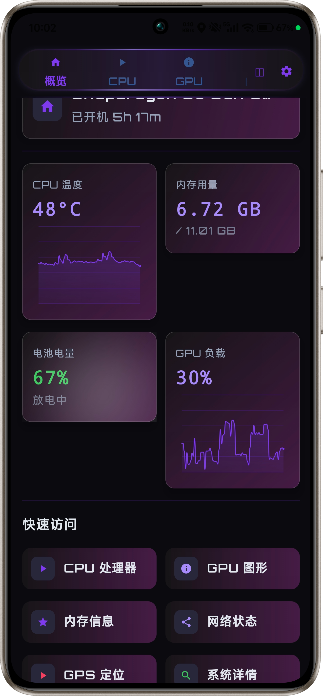
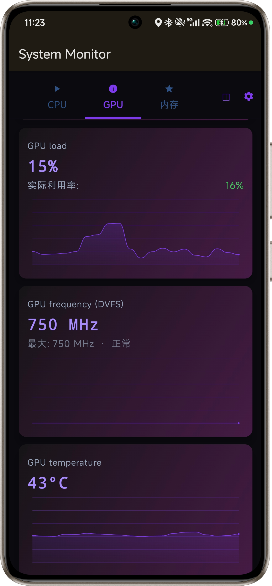
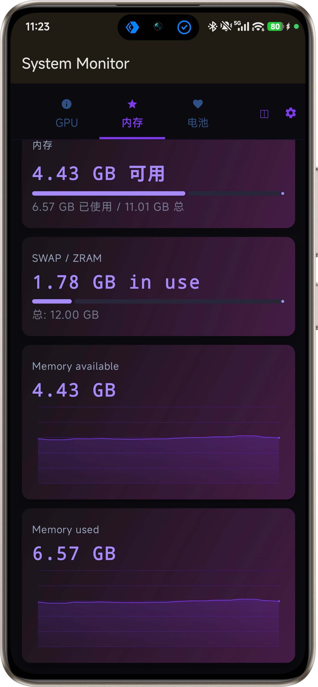
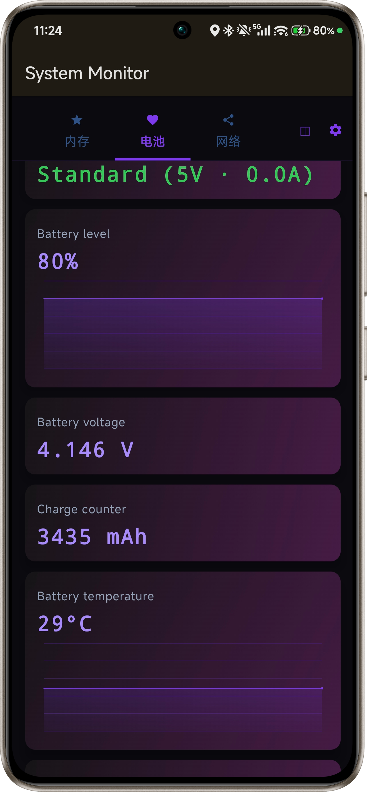
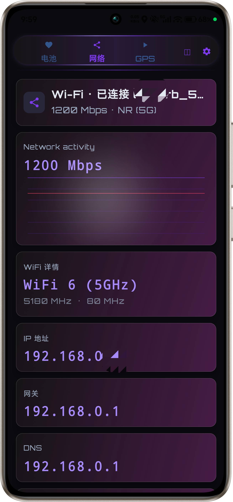
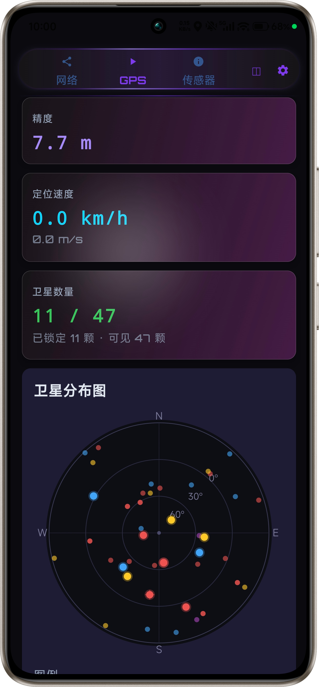
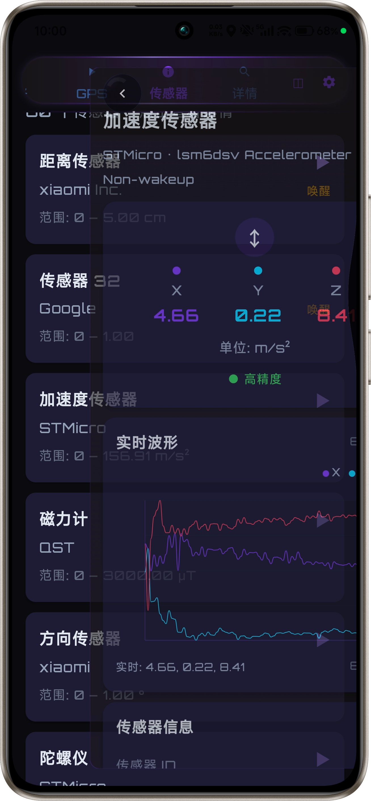
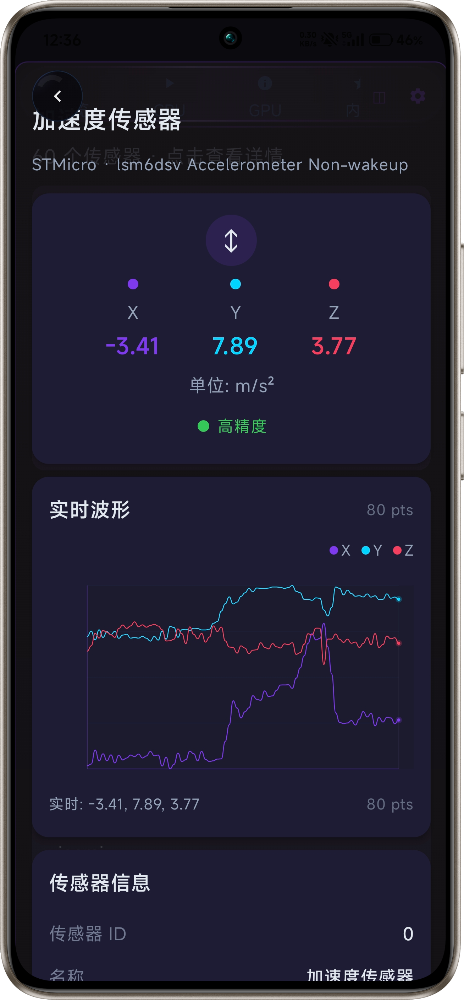
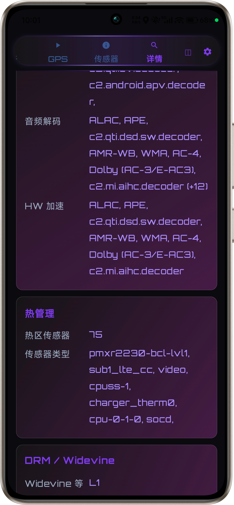
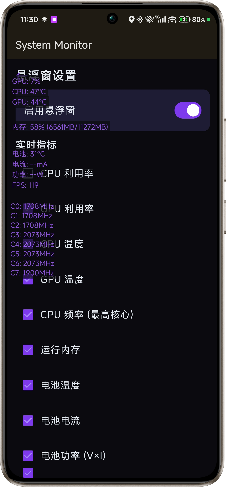

# 设备性能监控工具System Monitor(deviceinfoviewer\Device Info Viewer)



> **⚠️ 重要声明 / License Notice**  
> 本项目采用 **Source-Available (源码可见)** 许可。  
> **源码公开，仅供个人学习、研究和非商业用途**。  
> 严禁任何形式的商业使用（包括但不限于整合到商业产品、SaaS服务或企业内部盈利项目）。  
> 
> *This project is source-available and free for **personal, educational, and non-commercial use only**. Commercial use is strictly prohibited without a separate license.*

---

## 📱 项目

System Monitor(deviceinfoviewer)提供实时、精准的硬件状态数据可视化。通过简洁直观的深色界面，帮助开发者、硬件爱好者和普通用户全面掌握设备运行状态，优化性能体验。










---

## ✨ 核心功能
> 基于 **MVVM + Koin DI** 架构，**Jetpack Compose + Material3** 构建的全功能 Android 设备信息监控应用。
> 无 ROOT 权限下实现深度硬件检测，适配小米 HyperOS、OPPO ColorOS、Vivo OriginOS 等国产 ROM。

---

## 🎯 核心亮点

### 🔬 深度硬件检测（多级 Fallback 策略）

| 功能模块 | 检测深度 | Fallback 层级 |
|---------|---------|--------------|
| **CPU 温度** | HardwarePropertiesManager → sysfs thermal_zone → hwmon/平台专用 → SensorManager → 电池温度 | 5 级 |
| **GPU 频率/负载** | 50+ sysfs 路径 + 动态属性 + 负载估算 | 5 层 |
| **电池循环次数** | BatteryManager 隐藏 API → 50+ sysfs 路径 → dumpsys | 8 级 |
| **电池电流/容量** | 小米 BMS → OPPO oplus_chg → 15+ 路径 | 多厂商专项 |
| **GPS 卫星** | GNSS Status Callback (API 30+) + 反射兼容 (API 21-23) | 双 API |

### 🚀 骁龙平台专项优化
- 扫描 `thermal_message/` 直接温度文件（HyperOS 专用）
- 高通 `qcom-battery/` 电池循环计数路径

### 🎨 Batman 赛博朋克主题
- 纯紫霓虹配色（NeonPurple/Bright/Pale/Deep）
- 脉冲指示器（PulseDot）实时监测标志
- 矩阵数字字体 + 扫描线动画
- 全面屏 Edge-to-Edge 设计

---

## 📱 功能模块（9 大 Tab）

### ⚙️ 设置页（Android 15 预测性返回）
- 刷新频率：0.5s / 1s / 2s
- 覆盖层动画进入/退出
- `BackHandler` 支持手势返回

---

## 🖥️ 悬浮窗系统

- **8 个独立窗口**：CPU / GPU / 电池 / 内存 / 温度 / 网络 / Hz / FPS
- 独立拖拽（WindowManager + OnTouchListener）
- 实时 FPS 监控（Choreographer 帧回调）
- SharedPreferences 持久化配置
- 前台服务保活（foregroundServiceType = "specialUse"）

---

## 🔒 隐私安全

| 安全项 | 状态 |
|-------|------|
| INTERNET 权限 | ❌ 已移除 |
| 网络通信 | ❌ 零 HTTP 调用 / 零 WebView / 零遥测 |
| 数据导出 | ✅ 仅通过系统 ShareSheet（用户控制） |
| allowBackup | ❌ false（阻止云端备份） |
| 所有数据 | ✅ 完全本地化 |

---

## 🏗️ 技术架构

┌─────────────────────────────────────────────┐ │ UI Layer (Compose) │ │ Screen × 9 + Components + Theme │ └──────────────────┬──────────────────────────┘ │ observe ┌──────────────────▼──────────────────────────┐ │ ViewModel Layer (Koin DI) │ │ DashboardVM + CpuVM + GpuVM + MemoryVM │ │ BatteryVM + NetworkVM + GpsVM + SensorsVM │ │ DeviceVM + OemVM + SettingsVM │ └──────────────────┬──────────────────────────┘ │ collect ┌──────────────────▼──────────────────────────┐ │ Repository Layer (God Repo) │ │ DeviceRepository — 全局单例 + LiveData │ │ historyData: Map<String, List>│ └──────────────────┬──────────────────────────┘ │ read ┌──────────────────▼──────────────────────────┐ │ DataSource Layer (12 个) │ │ CpuDS + GpuDS + BatteryDS + MemoryDS │ │ NetworkDS + GpsDS + SensorsDS + DeviceDS │ │ OemDS + ShellCommandDS + SysFsReader │ └─────────────────────────────────────────────┘


### 技术栈
compileSdk = 35 (锁定，不与 Material 1.12.0 冲突) targetSdk = 35 minSdk = 21 Kotlin = 2.1.0 Compose = BOM 2024.12.01 Koin DI = 3.5.6 Java = 17


---

## 🛡️ 异常防护体系

###```kotlin
// ✅ 正确：catch Throwable（覆盖 OEM ROM 的 Error 子类）
try {
    val result = riskyOperation()
} catch (t: Throwable) {
    Log.w(TAG, "Operation failed", t)
}

// ❌ 错误：catch Exception（OEM ROM 可能抛 Error 子类）
try {
    val result = riskyOperation()
} catch (e: Exception) {
    // 抓不住 NoSuchMethodError / NoSuchFieldError
}
### 数据源健康监控
SourceHealth 数据类跟踪 13 个数据源状态
DataSourceHealthBar 组件实时展示错误数量
多级 fallback 链的 catch 保持静默（预期失败路径）
仅 Repository 级别记录异常
### 📊 图表系统
LineChart：贝塞尔曲线平滑 + 渐变填充 + 动画
DualLineChart：双折线图（下载/上传对比）
实时数据：DeviceRepository.historyData LiveData 推送
normalizeChartData()：自适应 Y 轴范围
### 🌐 OEM ROM 深度识别
OEM	系统	专属属性（15+）
小米	HyperOS/MIUI	miui.ui.version / miui.region / has_real_blur
OPPO	ColorOS	version.opporom / oplus.display / oplus_chg battery
Vivo	OriginOS	vivo.os.version / product.solution / hardware.version
SoC 制造商 + 型号识别
游戏模式 / 高性能模式检测
30+ 条厂商原始属性导出
### 🔧 充电协议自动识别
PD (Power Delivery)
QC 3.0 (Quick Charge)
SuperVOOC (OPPO)
VOOC (OPPO)
Mi Turbo Charge (小米)
### 📄 权限说明
权限	用途	必需
ACCESS_FINE_LOCATION	GPS 卫星检测	是
ACCESS_BACKGROUND_LOCATION	后台 GPS	是
SYSTEM_ALERT_WINDOW	悬浮窗	是
BLUETOOTH	蓝牙信息	否
READ_PHONE_STATE	SIM 信息	否
### 🏆 竞品对比
功能	My Application	
电池循环次数	✅ 50+ 路径
GPU 动态频率	✅ 5 层 fallback
充电协议识别	✅	
悬浮窗 FPS	✅	
OEM ROM 识别	✅ 3 大厂商	
隐私（零网络）	✅	
### 📚 学术验证
通过 Sciverse 学术论文检索 验证架构设计：

"Rancid: Reliable Benchmarking on Android Platforms" → ✅ sysfs 是标准方法
"Green smartphone GPUs" (GPULogger App) → ✅ 架构与学界一致
"User-centric Joint Power and Thermal Management" → ✅ hwmon 是 Linux 标准
"Android Security Internals" (SELinux) → ✅ 解释 Android 11+ 限制
"A COMPARATIVE STUDY OF SOFTWARE ARCHITECTURES" → ✅ MVVM 是学界推荐
